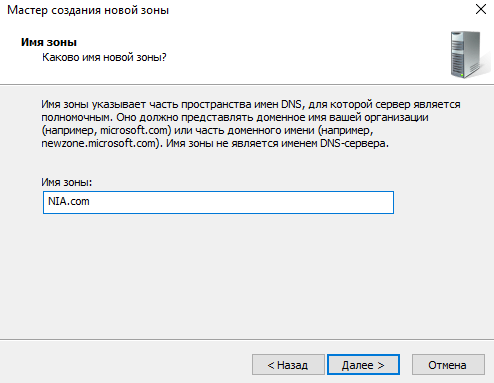
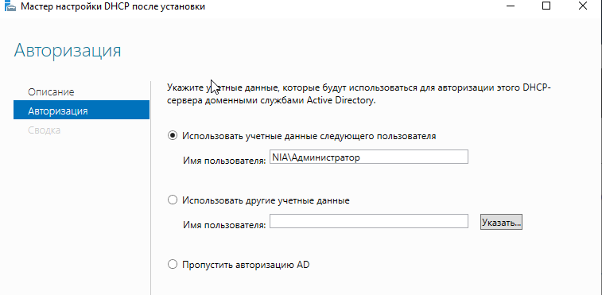
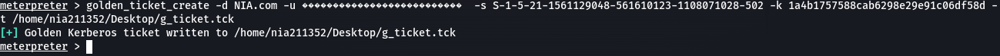

<b>Автор таска</b>: Непомнящих Игорь Алексеевич  
<b>Темы</b>: Атака Golden Ticket  
<b>Инструменты для решения задач</b>: impacket, kiwi, mimikatz  

Установка и настройка WINDOWS SERVER

Настройка компьютера пользователя для подключения к домену

Выполнение атаки Golden ticket.
Установим модуль impacket на kali

Получение SID юзера

Получение дампа хешей

Получение удаленного доступа к системе

Подключимся к Серверу через мсф

Установим kiwi и Получим сид

Создадим голден тикет:

Создадим тикет

Проверим тикет

