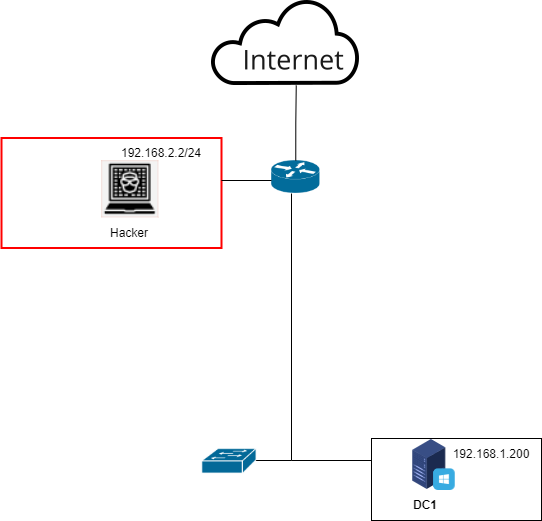

<b>Автор таска</b>: Аверин Илья Олегович  
<b>Темы</b>: Перебор пользователей, Распыление/ Подбор паролей  
<b>Инструменты для решения задач</b>: kerbute_linux_amd64 
Топология:  

<b>Описание стенда</b>:  
Стенд представляет под собой доменную инфраструктуру под управлением Active Directory. 
Все устройства, кроме хакера находятся под управлением контроллера домена (DC1). 
На всех хостовых устройствах настроен маршрут по умолчанию. 
DC1 – WinServer16 
Hacker – Kali Linux 
Router – Cisco 
Switch – Cisco 
<b>Условие пользователю</b>:   Появилась инсайдерская информация, что у одного из пользователей домена пароль Qwerty12. Укажите в ответе чей это пароль.  
Порога блокировки учётной записи нет.
 
<b>Справка пользователю</b>: 
Ссылка на инструмент Kerbrute - https://github.com/ropnop/kerbrute?tab=readme-ov-file  
<b>Информация для Blue team</b>: 
Отслеживать аномальные запросы на аутентификацию с неуспешной предварительной аутентификацией, например, при помощи системы анализа трафика и (или) системы управления событиями информационной безопасности. 
Для предотвращения атаки «Распыление пароля» необходимо реализовать строгую парольную политику:

1. Минимальная длина пароля: 10 для пользователей, 14 для администраторов.
2. Порог блокировки учетной записи: 5.
3. Время до сброса: 30 минут.
4. Длительность блокировки и сложность: по умолчанию.
5. Запретить использовать предыдущие пароли. Добавить правило, чтобы новый пароль отличался от предыдущих на не менее, чем 3 символа.
