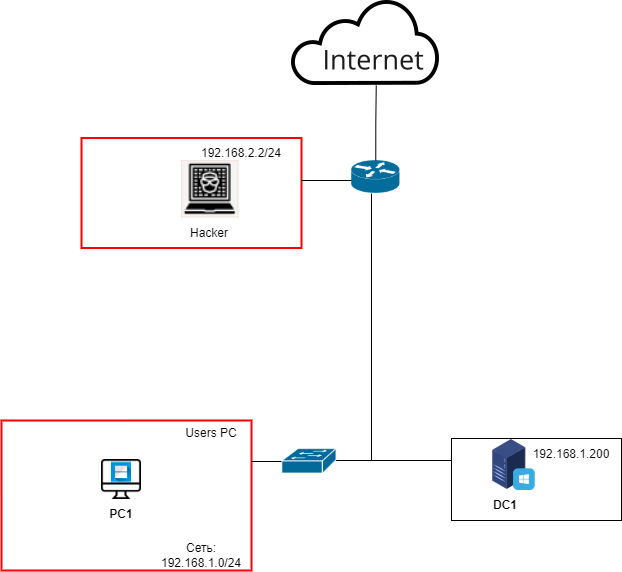

<b>Автор таска</b>: Аверин Илья Олегович  
<b>Темы</b>: Атака на SSH, Извлечение паролей из lsass.exe  
<b>Инструменты для решения задач</b>: sshprank, Mimikatz, hashcat  
Топология:  

<b>Описание стенда</b>:  
Стенд представляет под собой доменную инфраструктуру под управлением Active Directory. 
Все устройства, кроме хакера находятся под управлением контроллера домена (DC1). 
DC1 – WinServer16  
PC1 – Win 10 Pro (с открытым ssh портом на 22 порту с аутентификацией по паролю, без межсетевого экрана). 
Hacker – Kali Linux 
Router – Cisco (DNS не настроен) 
Дать пользователю файл с пользователями(users.txt) и паролями(passwords.txt), где хранятся креды от учётки для ssh-аутентификации. 
<b>Условие пользователю</b>:   Сеть 192.168.0.0/16. На домене контроллера открыт ssh-порт с аутентификацией по паролю и неограниченными попытками аутентификации. Необходимо предоставить в ответе и пароль от учётной записи Admin. На пользовательской машине отключён Windows Defender. 
<b>Справка пользователю</b>: 
SSHprank - это инструмент для тестирования на проникновение в систему с использованием протокола SSH. Он может выполнять различные атаки и тестировать уязвимости в SSH-серверах. Это инструмент, который может использоваться разработчиками и администраторами для обнаружения и устранения уязвимостей в SSH-серверах. Однако обратите внимание, что использование этого инструмента для атаки на несанкционированные системы может быть незаконным. 
Mimikatz — это приложение с открытым исходным кодом, которое позволяет пользователям просматривать и сохранять учетные данные аутентификации, такие как тикеты Kerberos. Бенджамин Делпи продолжает руководить разработкой Mimikatz, поэтому набор инструментов работает с текущей версией Windows и включает самые современные виды атак.  
Установка sshprank: 
sudo apt install python3-pip 
cd /tmp/ 
git clone https://github.com/noptrix/sshprank  
cd sshprank 
sudo pip3 install -r docs/requirements.txt 
./sshprank.py –H (в случае ошибки – через виртуальное окружение). 
<b>Информация для Blue team</b>: 
Самый верный способ защиты от взлома аутентификационных данных SHH – это использовать также аутентификацию по ключам, OTP-аутентификацию. Также использовать ограничение на количество раз неверной аутентификации за определённый промежуток времени (fail2ban в Linux). Также помогает определение ip-адресов и mac-адресов, с которых может происходить ssh-аутентификация к хосту (iptables).
