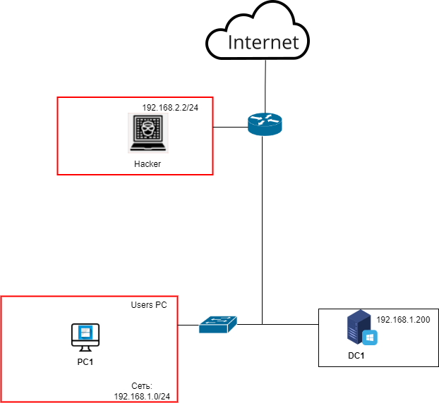

<b>Автор таска</b>: Аверин Илья Олегович <b>Темы</b>: Атака mitm6, Уязвимость IPv6  <b>Инструменты для решения задач</b>: nmap, mitm6, smbserver.py из impacket  <b>Топология</b>:
 </b>  <b>Описание стенда</b>:
Стенд представляет под собой доменную инфраструктуру под управлением Active Directory. 
Все устройства, кроме хакера находятся под управлением контроллера домена (DC1). 
DC1 – WinServer16 (разрешающий NTLMv2 аутентификацию, отключен DHCPv6). 
PC1 – Win10 (NetBIOS и LLMNR отключены) 
Hacker – Kali Linux 
Router – Cisco (DNS, DHCP не настроены) 
Switch – Cisco 
Скрипт бота: New-SmbMapping -RemotePath '\\server' -Username "domain\username" -Password "password" через Scheduled Tasks или PowerShell Sheduled_Jobs
Пароль пользователя должен поддаваться бруд-форсу по его NTLMv2-хэшу.   Пароль пользователя должен поддаваться бруд-форсу по его NTLMv2-хэшу.   Сеть 192.168.0.0/16. На одном из пользовательских ПК есть бот, который неправильно вводит имя SMB-сервера (пользователь пытался пройти по сетевому пути и допустил опечатку) и вводит свои аутентификационные данные. Необходимо предоставить в ответе логин и пароль найденной учётки. Протоколы Zeroconf на уязвимой машине отключены. На уязвимой машине включена возможность IPv6. DHCPv6-сервера в сети нет.   <b>Справка пользователю</b>: Если в корпоративной сети используется IPv6, мы можем ответить на запросы DHCPv6 и установить в качестве DNS-сервера на атакуемой машине свой IP-адрес. Так как IPv6 имеет приоритет над IPv4, DNS-запросы клиента будут отправлены на наш адрес.   <b>Информация для Blue team</b>: 
Отключать IPv6 при ненадобности. Если IPv6 нужен в сети, то следить, чтобы у каждой машины в сети был доверенный DHCPv6-сервер.
