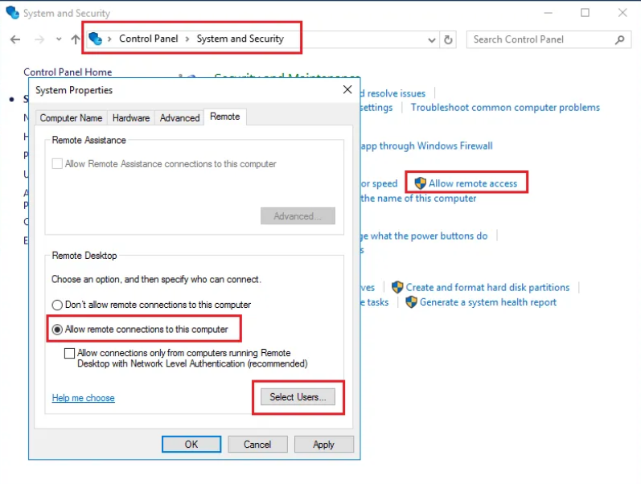

1. Настроить kali и Win16 Server в одной подсети (Например, подсеть: 192.168.1.0/24)
2. Создать на рабочем столе Win16 Server текстовый файл с флагом(Например: fwfewfgergrr34).
3. Выключить SMB-сервер, включить RDP для администроторов:
     
   Появится меню, где можно выбрать пользователей.  
   Выбираем администраторов  
   Также применим команду  
   New-ItemProperty -Path “HKLM:\System\CurrentControlSet\control\Lsa” -Name “DisableRestrictedAdmin” -Value “0” -PropertyType DWORD –Force
4. Разрешить NTLM в домене.
5. Скачать nmap, xfreerdp, zerologon (https://github.com/risksense/zerologon), impacket (https://github.com/SecureAuthCorp/impacket) на kali.  
