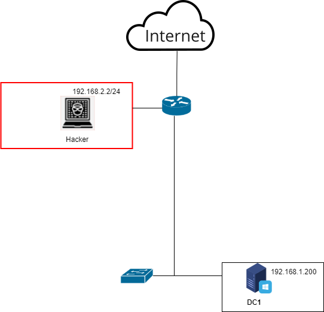

<b>Автор таска</b>: Аверин Илья Олегович  
<b>Темы</b>: Zerologon, RDP-уязвимость  
<b>Инструменты для решения задач</b>: xfreerdp, zerologon, impacket  
Топология:  

<b>Описание стенда</b>:  
Стенд представляет под собой доменную инфраструктуру под управлением Active Directory. 
Все устройства, кроме хакера находятся под управлением контроллера домена (DC1). 
На всех хостовых устройствах настроен маршрут по умолчанию. 
DC1 – WinServer16 (с включенным RDP и текстовым файлом, в котором находится флаг, установить имя машины DC1 и с дампом ntds). 
Hacker – Kali Linux 
Router – Cisco 
Switch – Cisco
 
<b>Условие пользователю</b>:   На рабочем столе котроллера домена находится текстовый файл с флагом, который необходимо ввести в качестве ответа. 
Для этого необходимо проэксплуатировать атаку Zerologon на контроллере домена. На контроллере домена выключен SMB-сервер, но зато включен протокол RDP для администраторов.
 
<b>Справка пользователю</b>: 
Zerologon — это уязвимость в протоколе шифрования, который использует служба Netlogon. Протокол позволяет компьютерам проходить аутентификацию на контроллере домена и обновлять пароль своего аккаунта в Active Directory. Именно эта особенность делает Zerologon опасной. В частности, уязвимость позволяет атакующему выдать себя за контроллер домена и изменить его пароль. Злоумышленник получает доступ к контроллеру домена c наивысшими привилегиями, а следовательно — и к корпоративной сети. После смены пароля атакующий может использовать учетную запись контроллера домена для развития атаки, например, выполнив атаку DCSync (получение учетных записей Active Directory через механизм репликации). 
RDP (Remote Desktop Protocol) — это протокол сетевой связи, позволяющий пользователям безопасно подключаться к удаленному компьютеру с помощью другого компьютера или мобильного устройства. 
Утилита для проведения Zerologon: https://github.com/risksense/zerologon
 
<b>Информация для Blue team</b>: 
Не стоит включать RDP без необходимости.
